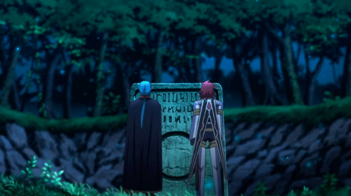

  # Finley
  *“Death can have me, when it earns me.”* — **Kratos**

  

  ---

  

   

  <!-- Core Tech Stack (Einfarbig/Dark-Themed wirkt cleaner) -->
  

  ---

  

    

  Readable code. Predictable systems.

